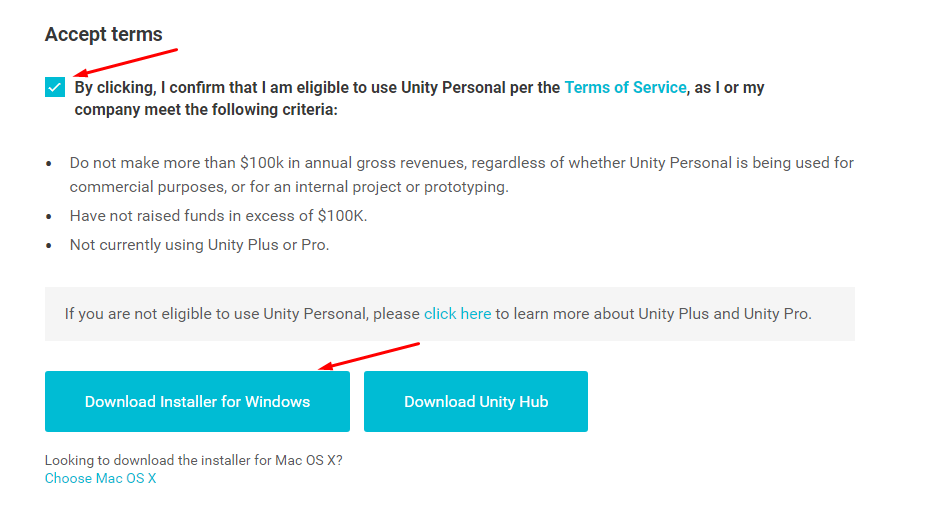

# DevFest2018

Repository for the [DevFest 2018](https://devfest18.gdgtrento.it) workshop material

## What do you need

1. [Unity3D](https://unity3d.com)
2. [DevFest2018_project](http://bit.ly/uug-devfest-18-project) archive

## 1 - Unity3D

### 1.1 - How to install Unity3D

- Download [Unity3D](https://store.unity.com/download?ref=personal) installer (Personal licence)

- Open the installer

- Deselect every component except the Unity editor

**Note**: IDE/notepad needed (*i.e.* Visual Studio Code)

- Follow **Unity Download Assistant** remaining instructions

### 1.2 - How to open the project

- Open Unity3D
- If you already have an account, log in. Otherwise press *Skip*

- Press *Open*

- Locate the project folder (see next section) and click on *Select folder*

## 2 - Project material 

### 2.1 - How to prepare the project

- Go to the [project](http://bit.ly/uug-devfest-18-project) link

- Click on the *Download* button

- Click on *Download anyway*
- Unzip the archive into a designated folder

## 3 AR Workshop 
A compatible device:
- An Android device with [ARCore](https://play.google.com/store/apps/details?id=com.google.ar.core&hl=en_US) installed
- An iPhone 6S or newer, iPad 2017 or newer

### Android
1. Install [Android Studio](https://developer.android.com/studio) with **Android SDK 7.0 (API Level 24) or later**

### iOS
1. Install XCode 9 beta or later, with iOS SDK that includes ARKit Framework

